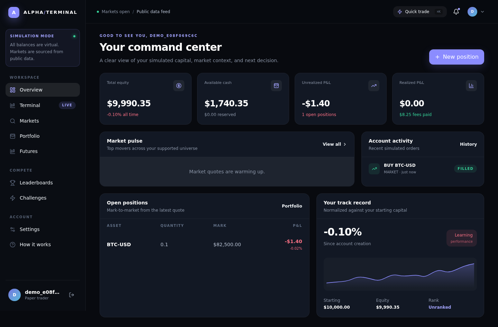
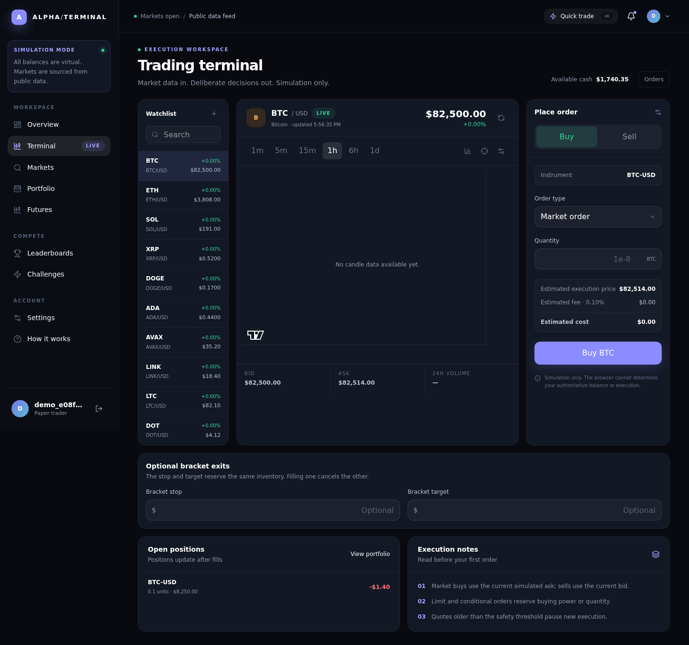
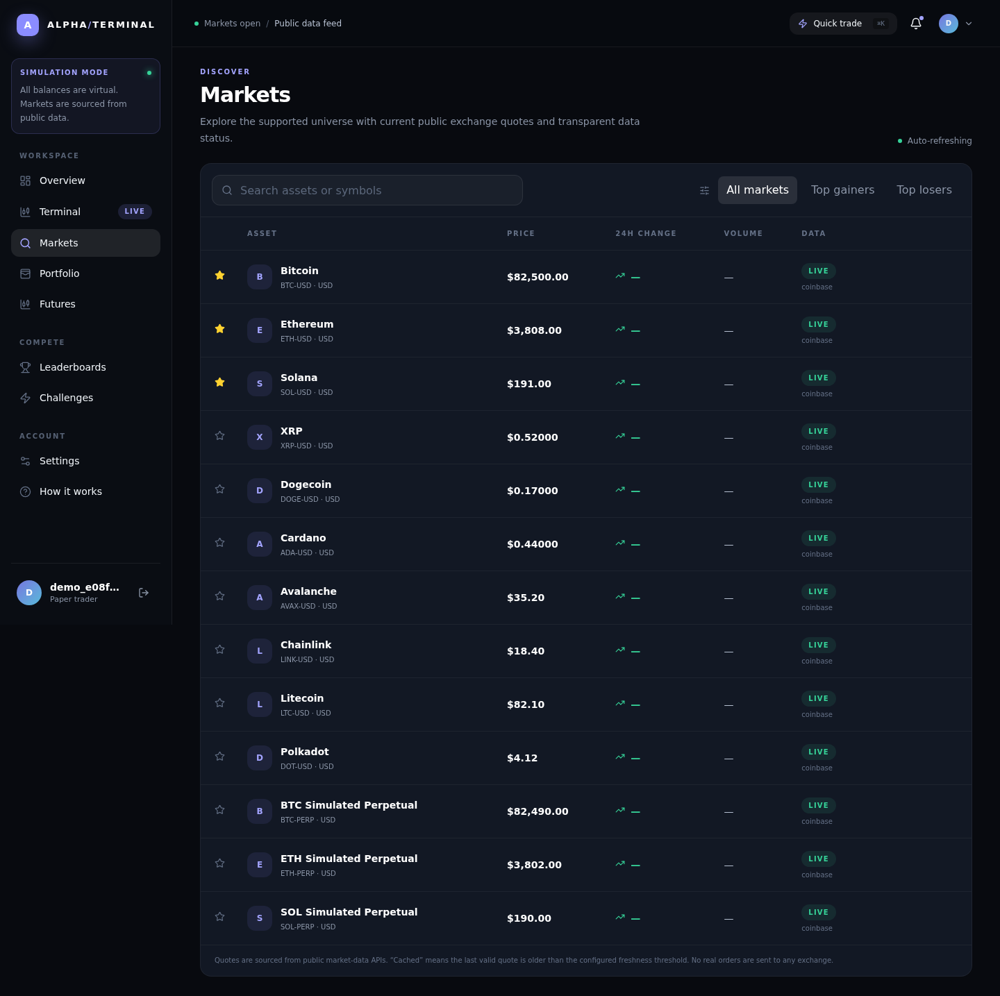
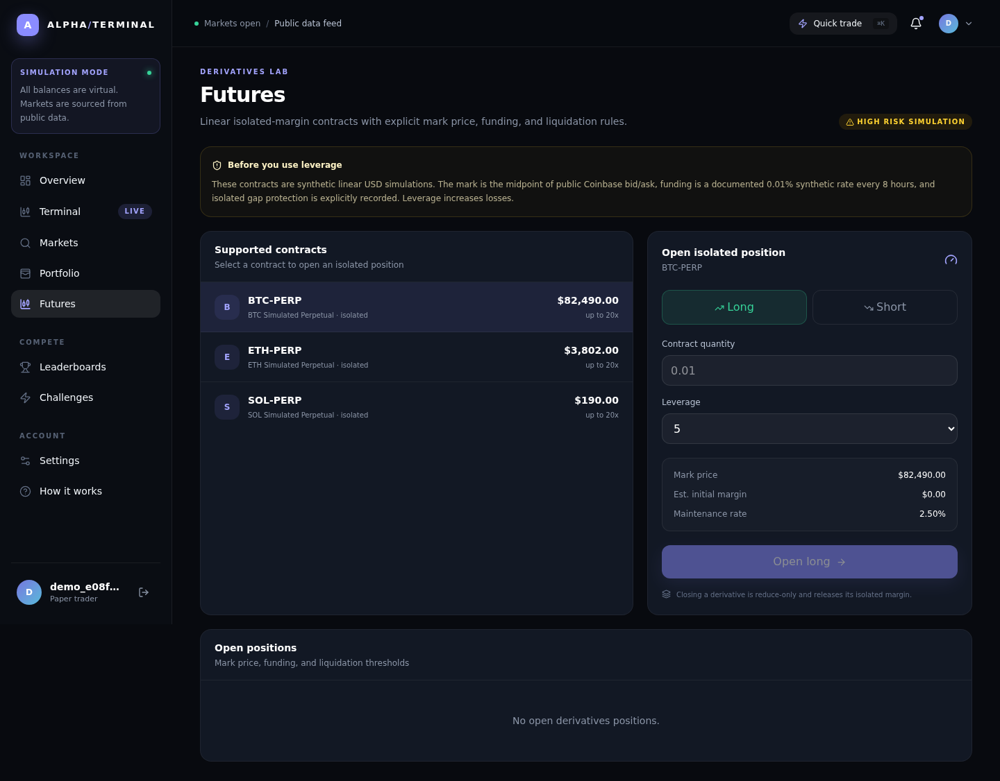
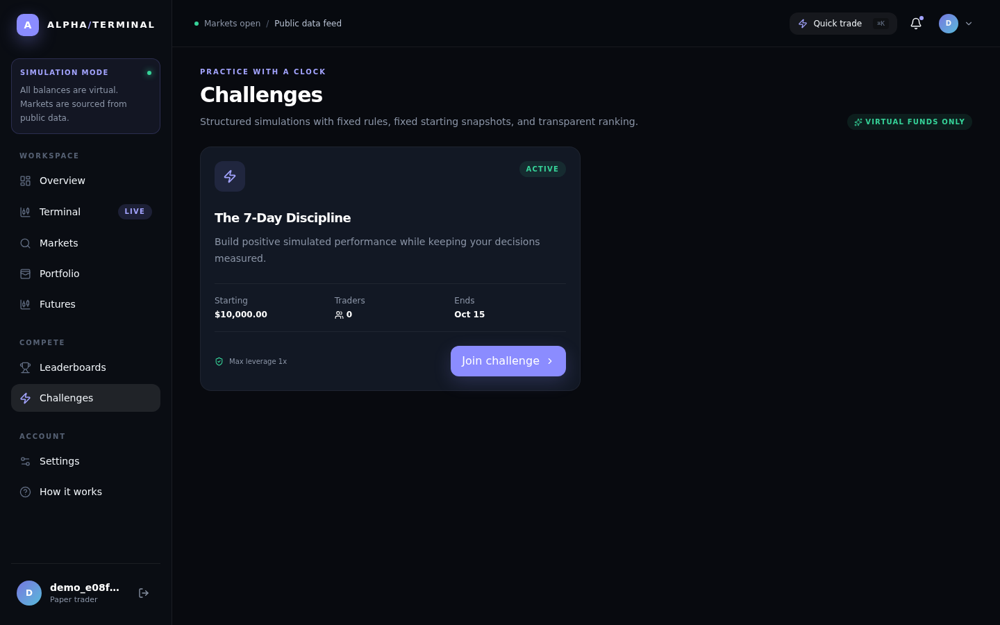
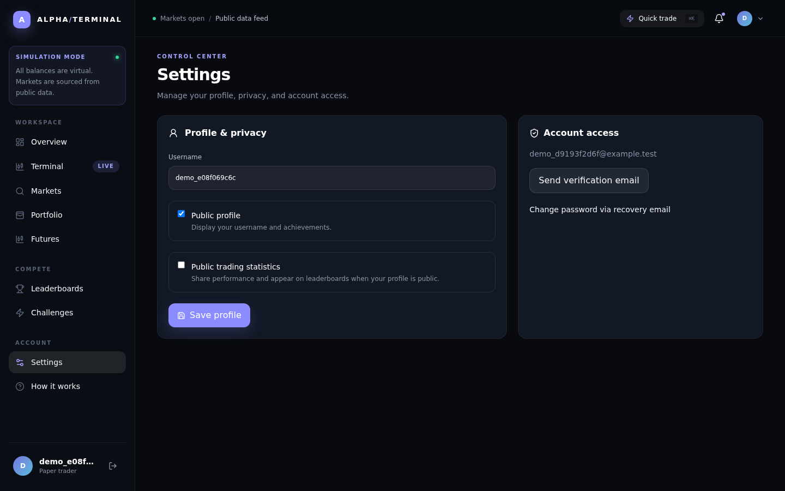
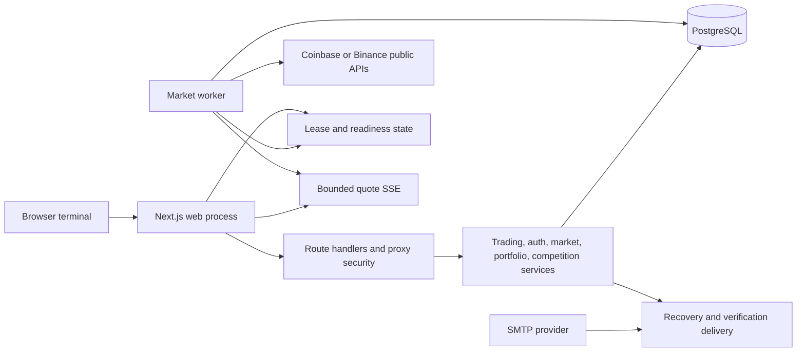

# ALPHA TERMINAL

<p align="center">
  <strong>A production-minded paper-trading terminal for disciplined market practice.</strong><br />
  Virtual capital, authoritative server-side accounting, public market data, challenges, and operational safeguards in one focused workspace.
</p>

<p align="center">
  <a href="https://github.com/DragonPlayz-1/alpha-terminal/actions/workflows/ci.yml"></a>
  <a href="https://github.com/DragonPlayz-1/alpha-terminal/actions/workflows/e2e.yml"></a>
  
  
  
</p>

> **Important:** ALPHA TERMINAL is a simulator. It uses virtual funds and simulated fills, does not place real exchange orders, and does not provide investment advice.

## Product tour

| Command center | Terminal | Markets |
| :---: | :---: | :---: |
| [](docs/screenshots/dashboard.png) | [](docs/screenshots/terminal.png) | [](docs/screenshots/markets.png) |

| Futures | Challenges | Account controls |
| :---: | :---: | :---: |
| [](docs/screenshots/futures.png) | [](docs/screenshots/challenges.png) | [](docs/screenshots/settings.png) |

## Why this project exists

Trading interfaces make it easy to focus on execution and forget process. ALPHA TERMINAL is designed as a deliberate practice environment: every account has virtual capital, every balance-changing action is recorded server-side, and stale or ambiguous market data is rejected instead of silently producing a misleading result.

The application combines:

- A focused dark terminal interface for spot and isolated linear perpetual simulation.
- Live and cached public market data with freshness metadata.
- Atomic balances, reservations, positions, executions, fees, and ledger entries.
- Idempotent order submission for safe browser retries.
- Challenges, leaderboards, achievements, privacy controls, and public profiles.
- A separately supervised market worker with database-backed leasing and readiness checks.
- Security controls covering opaque sessions, CSRF/origin validation, rate limits, body limits, and immutable financial records.

## Feature set

### Trading workspace

- Market, limit, stop-loss, take-profit, and reduce-only order flows.
- Spot assets and synthetic isolated linear perpetual contracts.
- Position sizing, leverage limits, tick-size validation, minimum quantities, and exposure checks.
- Bracket/OCO exits with server-side resizing and cancellation rules.
- Top-of-book simulated fills using the current bid/ask and a configurable fee rate.
- Quote freshness enforcement so execution cannot use an expired market snapshot.
- Retry-safe `clientOrderId` fingerprints that prevent duplicate financial effects.

### Portfolio and competition

- Immutable initial-capital ledger entries.
- Weighted-average spot cost basis and realized P&L.
- Margin, maintenance margin, funding, liquidation, and reservation accounting.
- Portfolio snapshots, history, watchlists, notifications, and order history.
- Challenge-specific accounts with deadlines, eligibility rules, finalization, and manual-review states.
- Privacy-aware public profiles and snapshot-based leaderboards.
- Achievement tracking and atomic deduplication.

### Operations and security

- HMAC-protected opaque session tokens with production-safe cookie settings.
- Password reset and email verification tokens stored as hashes and consumed once.
- Origin, Referer, and Fetch Metadata mutation checks.
- Request body-size limits for both buffered and chunked requests.
- Database-backed rate limiting with trusted-proxy configuration.
- Worker lease exclusivity, heartbeats, takeover, fencing, and readiness reporting.
- PostgreSQL constraints and triggers protecting immutable financial records.
- Standalone Next.js deployment packaging with generated environment files removed.

## Architecture



The web process owns authenticated request handling. The worker owns shared quote ingestion and background execution. Both use PostgreSQL as the source of truth; the worker lease ensures only one active worker performs scheduled work for a deployment. See [`docs/architecture.md`](docs/architecture.md) for the detailed data flow and consistency model.

## Technology

- **Web:** Next.js 16 App Router, React 19, TypeScript, Tailwind CSS 4.
- **Data:** PostgreSQL 15+, Prisma 6, Decimal.js.
- **Authentication:** server-side opaque sessions, bcrypt password hashes, Zod validation.
- **Market data:** Coinbase Exchange public endpoints by default; Binance public polling adapter available for a fresh instrument registry.
- **Testing:** Vitest unit/integration tests and Playwright Chromium production-flow tests.
- **Deployment:** Next.js standalone output, separate web and worker processes, optional Docker multi-stage image.

## Prerequisites

- Node.js 22 or newer.
- npm 10 or newer.
- PostgreSQL 15 or newer.
- A private local PostgreSQL database and role.
- Chromium dependencies if running Playwright locally.

Docker is optional. The application can be developed, tested, built, and run directly with Node.js and PostgreSQL.

## Quick start

### 1. Install dependencies

```bash
git clone https://github.com/<your-account>/alpha-terminal.git
cd alpha-terminal
npm ci
```

### 2. Create a PostgreSQL database

Create a local database and a role with ownership or migration privileges. For example:

```sql
CREATE ROLE alpha_terminal LOGIN PASSWORD 'use-a-local-secret';
CREATE DATABASE alpha_terminal OWNER alpha_terminal;
```

Do not use a superuser or a production password for local development.

### 3. Configure the environment

```bash
cp .env.example .env
```

Set at least `DATABASE_URL` and a random `SESSION_SECRET` with 32 or more characters. `.env` is ignored by Git and must never be committed.

### 4. Apply migrations and seed the registry

```bash
npx prisma migrate dev
npm run db:seed
```

The seed creates the default instruments, synthetic perpetuals, achievements, and the starter challenge. It does not create a shared demo password or administrator account.

### 5. Start the web process

```bash
npm run dev
```

Open <http://localhost:3000>, create an account, choose virtual starting capital, and open the terminal.

### 6. Start the background worker

In a second terminal:

```bash
npm run dev:worker
```

The worker refreshes quotes, processes eligible open orders, applies derivatives maintenance, writes snapshots, and performs cleanup. `/api/ready` reports `503` until the worker has acquired its lease and completed a successful cycle.

## Environment reference

| Variable | Required | Description |
| --- | :---: | --- |
| `DATABASE_URL` | Yes | PostgreSQL connection string. Keep it private. |
| `SESSION_SECRET` | Production | At least 32 random characters for session HMACs. |
| `NEXT_PUBLIC_APP_URL` | Yes | Canonical browser URL used for links and origin validation. |
| `APP_URL` | No | Server-side canonical URL override when public and internal URLs differ. |
| `NEXT_PUBLIC_APP_NAME` | No | Display name; defaults to `ALPHA TERMINAL`. |
| `MARKET_PROVIDER` | No | `coinbase` by default or `binance` for a fresh registry. |
| `BINANCE_REST_URL` | No | Binance public REST base URL. |
| `QUOTE_MAX_AGE_MS` | No | Maximum quote age accepted by execution; default `15000`. |
| `TRADING_FEE_RATE` | No | Simulated fee rate; default `0.001`. |
| `TRUSTED_ORIGINS` | No | Comma-separated additional browser origins behind a trusted proxy. |
| `TRUSTED_CLIENT_IP_HEADER` | No | Proxy-controlled client-IP header used for rate limiting. |
| `SMTP_URL` | No | `smtp://` or `smtps://` transport for recovery mail. |
| `MAIL_FROM` | No | Sender identity for recovery and verification messages. |
| `ADMIN_EMAIL` | Bootstrap only | Administrator email for `npm run db:admin`. |
| `ADMIN_PASSWORD` | Bootstrap only | 10–72-byte administrator password. |
| `ADMIN_USERNAME` | Bootstrap only | Administrator username; defaults to `operator`. |
| `ADMIN_INITIAL_CAPITAL` | Bootstrap only | Initial virtual capital; defaults to `10000`. |

Never place exchange private keys, production credentials, access tokens, or SMTP passwords in source control. This project only uses public market-data endpoints.

## Database workflow

```bash
# Generate the Prisma client
npm run db:generate

# Local development: create/apply a migration
npm run db:migrate

# Production/release environments: apply committed migrations only
npm run db:deploy

# Seed instruments, achievements, and the starter challenge
npm run db:seed

# Create or reset an administrator from environment variables
npm run db:admin
```

Use a release step for `prisma migrate deploy`; do not run `migrate dev` against a production database.

## Market data and simulation rules

Coinbase is the default public provider. It supplies product quotes and public candles without private exchange credentials. Binance polling is supported for a fresh registry using provider symbols such as `BTCUSDT`; existing instrument rows are authoritative and should be changed through a controlled migration.

The seeded perpetuals (`BTC-PERP`, `ETH-PERP`, and `SOL-PERP`) are synthetic linear USD contracts. Their persisted specifications include isolated margin, 1–20x leverage, midpoint mark pricing, 2.5% maintenance margin, a 0.5% liquidation fee, and a synthetic 0.01% / 8-hour funding rate. They are simulator contracts, not exchange-listed futures.

Fills are deliberately approximate. The simulator uses top-of-book prices rather than exchange-depth matching, and does not model real liquidity, queue position, network latency, or guaranteed execution. Stale or missing quotes are rejected when they exceed `QUOTE_MAX_AGE_MS`.

## Accounting guarantees

- Initial capital is immutable and recorded as an `INITIAL_CAPITAL` ledger transaction.
- Spot positions use weighted-average cost basis.
- Market buys use the current ask; market sells use the current bid.
- Limit buys reserve cash until fill or cancellation.
- Order, execution, position, balance, fee, reservation, and ledger changes are atomic database transactions.
- `clientOrderId` is unique per account with a request fingerprint for safe retries.
- PostgreSQL constraints and triggers protect execution identity and finalized financial records.
- Reconciliation endpoints compare derived balances, inventory, and reservations against the ledger.

## Production deployment

### Release checklist

1. Provision private PostgreSQL with backups, TLS, monitoring, and restricted network access.
2. Configure a strong `SESSION_SECRET`, canonical HTTPS URL, SMTP, and trusted proxy settings.
3. Run committed migrations:

   ```bash
   npx prisma migrate deploy
   ```

4. Build the standalone web artifact:

   ```bash
   npm ci
   npm run build
   ```

5. Run the web process and one logical worker process separately:

   ```bash
   npm run start
   npm run dev:worker
   ```

   Use a process supervisor such as systemd, PM2, Kubernetes, or a managed platform in production. The worker lease protects against accidental duplicate workers, but it does not replace deployment supervision.

6. Put TLS and a trusted reverse proxy in front of the web process.
7. Monitor:
   - `GET /api/health` for application/database liveness.
   - `GET /api/ready` for database plus worker readiness.
   - Worker lease heartbeat and error logs.
   - PostgreSQL storage, locks, connections, backups, and reconciliation results.

### Standalone or Docker

The build produces `.next/standalone` and removes generated dotenv files before packaging. The included multi-stage `Dockerfile` provides separate `web` and `worker` targets:

```bash
docker build --target web -t alpha-terminal-web .
docker build --target worker -t alpha-terminal-worker .
docker run --env-file .env -p 3000:3000 alpha-terminal-web
docker run --env-file .env alpha-terminal-worker
```

Docker is optional; direct Node.js execution follows the same release contract.

## Testing and verification

The test runner creates a fresh PostgreSQL schema for each invocation and refuses to run against a remote database unless `TEST_DATABASE_URL` is explicit. It never truncates the public schema.

```bash
npm run typecheck
npm run lint
npm test
npm run build
npm run test:e2e
npm audit
```

The E2E suite builds and starts a copied standalone artifact, exercises the production HTTP surface with Playwright, verifies session/order/privacy behavior, tests oversized chunked bodies, covers recovery email flows, and checks worker exclusivity and takeover.

## Project structure

```text
app/             Next.js routes, pages, layouts, and API handlers
components/      Client-side terminal, portfolio, markets, and settings UI
lib/             Environment, API, formatting, database, and client utilities
prisma/          Schema, migrations, and seed data
server/          Auth, market data, trading, valuation, competition, and security domain services
worker/          Background market ingestion and execution worker
scripts/         Standalone packaging, startup, test isolation, and admin tooling
tests/           Unit, integration, and production E2E tests
docs/            Architecture, operations, screenshots, and contribution material
```

## API surface

The application exposes authenticated routes for:

- `/api/auth/*` — registration, login, logout, sessions, recovery, and verification.
- `/api/markets/*` — quotes, movers, instruments, and candles.
- `/api/orders/*` — scoped order creation, lookup, cancellation, and execution history.
- `/api/portfolio/*` and `/api/positions` — valuation, history, and positions.
- `/api/futures` — synthetic perpetual instruments and positions.
- `/api/challenges/*` and `/api/leaderboards` — challenge participation and rankings.
- `/api/watchlists` and `/api/notifications` — user workspace features.
- `/api/health` and `/api/ready` — operational health and worker readiness.
- `/api/admin/*` — protected reconciliation and instrument/configuration operations.

## Security and responsible disclosure

Please read [`SECURITY.md`](SECURITY.md) before reporting a vulnerability. Do not open a public issue containing credentials, private connection strings, session material, or an exploitable proof of concept.

## Contributing

Bug reports, focused improvements, documentation updates, and test coverage are welcome. Read [`CONTRIBUTING.md`](CONTRIBUTING.md) before opening a pull request.

## License

ALPHA TERMINAL is released under the [MIT License](LICENSE).

## Disclaimer

This software is for education, experimentation, and entertainment. All balances and fills are simulated. Nothing in this repository is financial, investment, tax, legal, or trading advice, and no result is guaranteed.
