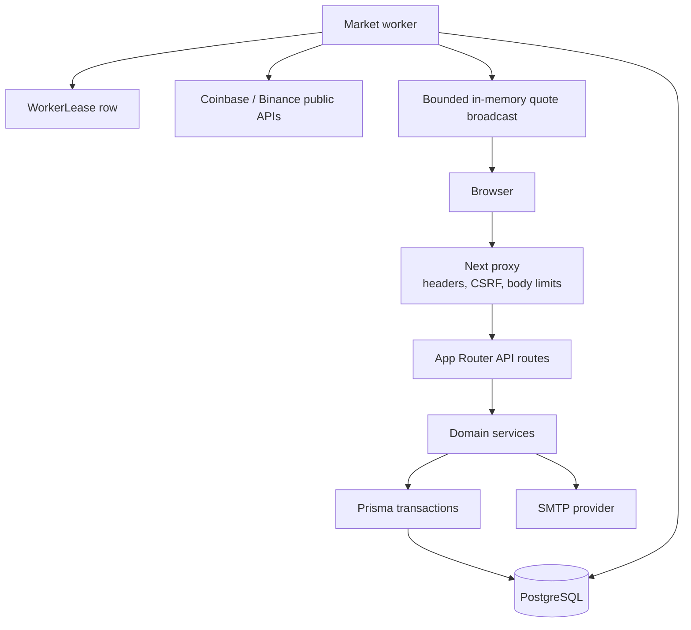

# Architecture

ALPHA TERMINAL is a server-authoritative paper-trading system. The browser renders the workspace and submits intent; PostgreSQL-backed domain services decide whether an action is valid and persist every balance-changing result.

## Runtime topology

## Request lifecycle

1. The proxy applies security headers and rejects unsafe mutations that fail origin or Fetch Metadata checks.
2. The route authenticates the opaque session and resolves the requested account scope.
3. Zod schemas validate shape, ranges, symbols, quantities, prices, and order semantics.
4. The domain service reads the authoritative instrument, quote, user, and account records.
5. A Prisma transaction locks the account rows needed for the mutation.
6. Decimal arithmetic derives reservations, fees, fills, balances, positions, and ledger entries.
7. Database constraints/triggers enforce immutable identities and finalized-state rules.
8. The route returns a normalized response; the browser may retry with the same idempotency key.

## Accounting invariants

- Every account starts with one immutable initial-capital ledger entry.
- Balance, reservation, inventory, and ledger deltas are written in one transaction.
- An order’s client identity and request fingerprint prevent a retry from creating a second financial effect.
- Ownership and scope are resolved on the server for every order, portfolio, challenge, and public-profile request.
- Quotes older than the configured maximum are not eligible for execution.
- Reconciliation derives expected balances/inventory and reports drift without silently repairing financial records.

## Worker lifecycle

The worker attempts to acquire a single `WorkerLease` row. The owner renews the lease and records successful cycles. Long-running account transactions fence themselves against the current owner and unexpired lease. A process that loses the lease cannot commit a protected worker transaction. `/api/ready` requires both database connectivity and a recent successful worker cycle.

The worker is responsible for:

- Public quote polling and stream watchdogs.
- Open-order execution.
- Derivative mark, funding, margin, and liquidation maintenance.
- Portfolio and leaderboard snapshots.
- Expired challenge finalization.
- Session, token, and rate-limit cleanup.

## Data boundaries

- **Web process:** authenticated requests, rendering, API responses, and bounded quote subscriptions.
- **Worker process:** shared market ingestion and scheduled execution.
- **PostgreSQL:** source of truth for identity, authorization, instruments, quotes, orders, executions, balances, positions, ledger, snapshots, challenges, and leases.
- **Public providers:** read-only market-data inputs. No private exchange API credentials are required.

## Scaling notes

The worker lease supports multiple accidental worker processes by allowing only one owner to perform protected work. Quote SSE broadcast is process-local; deployments with multiple web replicas should add Redis/Upstash fanout or use an equivalent shared realtime transport. PostgreSQL connection limits, backups, and lock monitoring remain deployment concerns.
